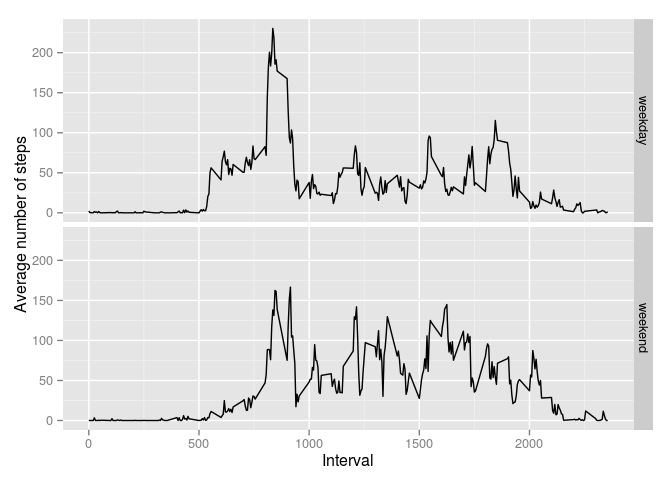

# Reproducible Research: Peer Assessment 1

This document is the submission for Peer Assignment 1 of the Coursera Data Science course *Reproducible Research*. It was forked from the GitHub repository [RepData_PeerAssessment1](https://github.com/rdpeng/RepData_PeerAssessment1) and extended as specified in the [exercise description](https://class.coursera.org/repdata-011/human_grading/view/courses/973512/assessments/3/submissions). 

## Loading and preprocessing the data

Load the data in a CSV file wrapped up in a zip file. As the date column will be a factor convert it to a POSIX date field. The first few rows of the data frame are displayed for sanity checking.


```r
# read the CSV file within the ZIP file
activity <- read.csv (unz ("activity.zip", "activity.csv"))

# convert the date to a POSIX date column
activity$date <- as.POSIXct (activity$date)

# examine the first few rows
head (activity)
```

```
##   steps       date interval
## 1    NA 2012-10-01        0
## 2    NA 2012-10-01        5
## 3    NA 2012-10-01       10
## 4    NA 2012-10-01       15
## 5    NA 2012-10-01       20
## 6    NA 2012-10-01       25
```

## What is mean total number of steps taken per day?

I am using Hadley Wickham's library *dplyr* to massage the activity data into the required form. The NA measurements are filtered out and the steps are summed up for each day. A histogram of the steps per day (bin width of 3000 steps) shows the distribution.


```r
library(ggplot2)
suppressPackageStartupMessages (library (dplyr, quietly=TRUE))

# use dplyr's pipe operator to filter and summarize
stepsByDate <-
  activity                      %>% # from activity
  filter (!is.na (steps))       %>% # take valid step counts
  group_by (date)               %>% # group it by the date
  summarize (nSteps=sum (steps))    # and total up the steps

# plot a histogram of the steps
qplot (stepsByDate$nSteps,
       xlab="Distribution of steps per day", ylab="Count",
       binwidth=3000)
```

 

The mean and median values of the steps per day are almost identical.


```r
# write out the mean of the steps
mean (stepsByDate$nSteps)
```

```
## [1] 10766.19
```

```r
# write the median of the steps
median (stepsByDate$nSteps)
```

```
## [1] 10765
```

## What is the average daily activity pattern?

The time series plot of the average step count by interval showing the activity over a 24-hour period. One can discern the diurnal cycle: sleep, followed by high activity in the morning, less intense movement in the afternoon and a quietening down towards the evening.


```r
meanStepsByInterval <-
  activity                      %>% # from activity
  filter (!is.na (steps))       %>% # take valid step counts
  group_by (interval)           %>% # group it by the date
  summarize (nSteps=mean (steps))   # and total up the steps

qplot (meanStepsByInterval$interval,
       meanStepsByInterval$nSteps,
       xlab="Interval",
       ylab="Average number of steps") +
   geom_line (color="blue", size=0.1) +
   geom_hline (aes (yintercept=mean (meanStepsByInterval$nSteps)),
               color="yellow",
               alpha=0.8)
```

 

The most active interval (ie the 5-minute interval with the most number of steps) is shown together the highest step count.


```r
highestStepCount <- max (meanStepsByInterval$nSteps)
meanStepsByInterval [meanStepsByInterval$nSteps == highestStepCount, ]
```

```
## Source: local data frame [1 x 2]
## 
##   interval   nSteps
## 1      835 206.1698
```

## Imputing missing values

The total number of missing values for the steps field:


```r
sum (is.na (activity$steps))
```

```
## [1] 2304
```

The strategy chosen for imputing missing values is to replace NA's with the average number of steps for that time interval.


```r
# make a new table from the original activity with a new field called nSteps that
# contains the average of that interval
cleanedActivity <- merge (meanStepsByInterval, activity, by="interval")
cleanedActivity$steps <-
  ifelse (is.na (cleanedActivity$steps),
          round (cleanedActivity$nSteps),
          cleanedActivity$steps)

# as done earlier, total the steps of each day
stepsByDate <-
  cleanedActivity               %>% # from activity
  filter (!is.na (steps))       %>% # take valid step counts
  group_by (date)               %>% # group it by the date
  summarize (nSteps=sum (steps))    # and total up the steps

# plot a histogram of the steps
qplot(stepsByDate$nSteps,
      xlab="Distribution of steps per day with imputed missing values",
      ylab="Count", binwidth=3000)
```

 

```r
# write out the new mean of the steps after cleaning the data
mean (stepsByDate$nSteps)
```

```
## [1] 10765.64
```

```r
# the median of the steps after cleaning the data
median (stepsByDate$nSteps)
```

```
## [1] 10762
```

As one can see, there is a small change in the median after imputing missing values; the mean is almost the same as before.

From the histogram one can see that total daily number of steps has increased when one compares it with the previous one.


## Are there differences in activity patterns between weekdays and weekends?


```r
weekdayType <- function (x) {
  listOfWeekdays <- c("Monday", "Tuesday", "Wednesday", "Thursday", "Friday")
  ifelse (weekdays (as.POSIXct (x)) %in% listOfWeekdays, "weekday", "weekend")
}

cleanedActivity$wd <- as.factor (weekdayType (cleanedActivity$date))

meanStepsByInterval <-
  cleanedActivity               %>% # from activity
  group_by (interval, wd)       %>% # group it by the date
  summarize (nSteps=mean (steps))   # and total up the steps

qplot (interval, nSteps, data=meanStepsByInterval,
       xlab="Interval", ylab="Average number of steps",
       facets=wd ~ .) +
   geom_line (color="blue", size=0.1)
```

 

end-of-document
